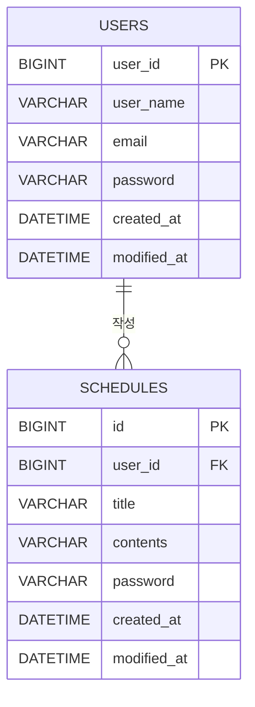

# 일정 관리 앱 API 명세서 & ERD

## 주요 기능

- 회원가입
- 로그인 / 로그아웃
- 유저 조회 / 수정 / 삭제
- 일정 CRUD
- 댓글 CRUD
- 로그인한 유저 기준 일정 생성
- 로그인한 유저 기준 댓들 생성

---

## API 명세서

### 1. 인증 API

| 기능 | Method | URL | 설명 |
|---|---|---|---|
| 회원가입 | POST | `/auth/signup` | 유저를 생성한다. |
| 로그인 | POST | `/auth/login` | 이메일과 비밀번호를 확인한 뒤 세션에 로그인 정보를 저장한다. |
| 로그아웃 | POST | `/auth/logout` | 현재 세션을 만료시킨다. |

#### 회원가입 요청

```json
{
  "userName": "신형탁",
  "email": "test@test.com",
  "password": "1234"
}
```

#### 회원가입 응답

```json
{
  "userId": 1,
  "userName": "신형탁",
  "email": "test@test.com",
  "createdAt": "2026-07-09T12:00:00",
  "modifiedAt": "2026-07-09T12:00:00"
}
```

#### 로그인 요청

```json
{
  "email": "test@test.com",
  "password": "1234"
}
```

#### 로그인 응답

```http
200 OK
```

#### 로그아웃 응답

```http
204 No Content
```

---

### 2. 유저 API

| 기능 | Method | URL | 설명 |
|---|---|---|---|
| 유저 전체 조회 | GET | `/users` | 전체 유저 목록을 조회한다. |
| 유저 단건 조회 | GET | `/users/{userId}` | 특정 유저를 조회한다. |
| 유저 수정 | PUT | `/users/{userId}` | 유저 정보를 수정한다. |
| 유저 삭제 | DELETE | `/users/{userId}` | 유저를 삭제한다. |

#### 유저 수정 요청

```json
{
  "userName": "수정된이름",
  "email": "updated@test.com",
  "password": "1234"
}
```

#### 유저 응답

```json
{
  "userId": 1,
  "userName": "신형탁",
  "email": "test@test.com",
  "createdAt": "2026-07-09T12:00:00",
  "modifiedAt": "2026-07-09T12:00:00"
}
```

---

### 3. 일정 API

| 기능 | Method | URL | 설명 |
|---|---|---|---|
| 일정 생성 | POST | `/schedules` | 로그인한 유저가 일정을 생성한다. |
| 일정 단건 조회 | GET | `/schedules/{scheduleId}` | 특정 일정을 조회한다. |
| 일정 전체 조회 | GET | `/schedules` | 전체 일정을 조회한다. |
| 유저별 일정 조회 | GET | `/users/{userId}/schedules` | 특정 유저가 작성한 일정 목록을 조회한다. |
| 일정 수정 | PUT | `/schedules/{scheduleId}` | 작성자와 비밀번호가 일치하면 일정을 수정한다. |
| 일정 삭제 | DELETE | `/schedules/{scheduleId}` | 비밀번호가 일치하면 일정을 삭제한다. |

#### 일정 생성 요청

로그인 세션에서 유저 정보를 가져오기 때문에 `userId`나 `writer`는 요청하지 않는다.

```json
{
  "title": "스프링 공부",
  "contents": "세션 기반 일정 생성 구현",
  "password": "1234"
}
```

#### 일정 생성 응답

```json
{
  "scheduleId": 1,
  "userName": "신형탁",
  "title": "스프링 공부",
  "contents": "세션 기반 일정 생성 구현",
  "createdAt": "2026-07-09T12:00:00",
  "modifiedAt": "2026-07-09T12:00:00"
}
```

#### 일정 수정 요청

```json
{
  "title": "수정된 일정",
  "contents": "수정된 내용",
  "password": "1234"
}
```

#### 일정 삭제 요청

```json
{
  "password": "1234"
}
```

---

## ERD



---

## 테이블 관계

### Users - Schedules

- 한 명의 유저는 여러 개의 일정을 작성할 수 있다.
- 하나의 일정은 한 명의 유저에게 속한다.
- 관계는 `User(1) : Schedule(N)`이다.
- `schedules` 테이블은 `user_id` 외래 키를 가진다.

---

## 핵심 구현 내용

### 1. 세션 기반 로그인

로그인 성공 시 세션에 로그인한 유저의 ID를 저장한다.

```java
session.setAttribute("LOGIN_USER", userId);
```

일정 생성 시에는 요청 Body에서 `userId`를 받지 않고, 세션에서 로그인한 유저 ID를 꺼내 사용한다.

```java
Long userId = (Long) session.getAttribute("LOGIN_USER");
```

---

### 2. 로그인 유저 기준 일정 생성

일정 생성 시 다음 흐름으로 처리한다.

```text
로그인 여부 확인
→ 세션에서 userId 조회
→ userId로 User 엔티티 조회
→ Schedule 생성 시 User 연결
→ 일정 저장
```

---

### 3. 일정 수정 권한 확인

일정 수정 시 로그인한 유저와 일정 작성자가 같은지 확인한다.

```java
if (!schedule.getUser().getUserId().equals(loginUserId)) {
    throw new IllegalArgumentException("작성자만 수정할 수 있습니다.");
}
```

그 후 비밀번호가 일치하는 경우에만 일정을 수정한다.

---

## 상태 코드

| 상태 코드 | 의미 |
|---|---|
| 200 OK | 조회, 수정, 로그인 성공 |
| 201 Created | 생성 성공 |
| 204 No Content | 삭제, 로그아웃 성공 |
| 400 Bad Request | 잘못된 요청 |
| 401 Unauthorized | 로그인 필요 |
| 404 Not Found | 리소스를 찾을 수 없음 |

